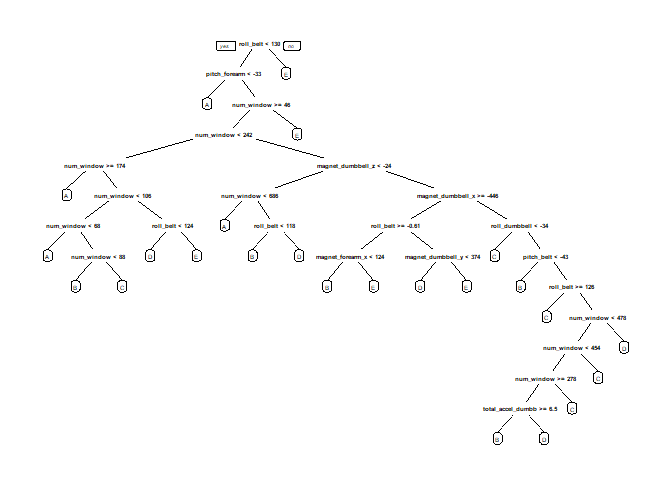
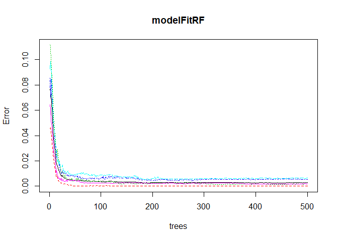

#Goal
The Goal of this project is to build a machine Learning algorithm which can correctly identify the quality of barbell bicep curls by using data from belt, forearm, arm, and dumbbell monitors. goal will be to use data from accelerometers on the belt, forearm, arm, and dumbell of 6 participants. They were asked to perform barbell lifts correctly and incorrectly in 5 different ways.

#Data
The training data for this project are available here:

[https://d396qusza40orc.cloudfront.net/predmachlearn/pml-training.csv]

The training data for this project are available here:

[https://d396qusza40orc.cloudfront.net/predmachlearn/pml-testing.csv]

#Getting Data


```r
getwd()
library("caret")
library("rattle")
library("rpart.plot")
library("rpart")
set.seed(54321)


TrainUrl <- "http://d396qusza40orc.cloudfront.net/predmachlearn/pml-training.csv"
        Training<- "training.csv"
        download.file(TrainUrl,Training)
        Training<-read.csv(Training,header = T,stringsAsFactors =TRUE)
        
TestUrl  <- "http://d396qusza40orc.cloudfront.net/predmachlearn/pml-testing.csv"
Testing<- "testing.csv"
download.file(TestUrl,Testing)
Testing<-read.csv(Testing, header = T,stringsAsFactors =TRUE)
```
File downloaded In local disk.


```r
head(Training);head(Testing)
```

As I have't showed result of "head" in this file but Both created datasets have 160 variables in this this data set and there are lot of NA's.we will ger rid of these NA valus step by step.
1) Removing veriable with Nearly Zero Variance


```r
NZV <- nearZeroVar(Training)
Training1 <- Training[, -NZV]
Testing1 <- Testing[, -NZV]

dim(Training1)
```

```
## [1] 19622   100
```

```r
dim(Testing1)
```

```
## [1]  20 100
```
Now veriable reduces to 100 in each set

2)removing NA's


```r
RemoveNA <- sapply(Testing1,function(x)mean(is.na(x))) > 0.95
Testing2  <- Testing1[, RemoveNA==FALSE]
Training2<- Training1[, RemoveNA==FALSE]


dim(Training2)
```

```
## [1] 19622    59
```

```r
dim(Testing2)
```

```
## [1] 20 59
```
After removing NA veriable size reduce to 59


coloumn 1:5 are identification veriable we dont need them for further analysis as they wont help much in analysis


```r
Training3 <- Training2[, -(1:5)]
Testing3  <- Testing2[, -(1:5)]

dim(Training3)
```

```
## [1] 19622    54
```

```r
dim(Testing3)
```

```
## [1] 20 54
```

#Partitioning Data sets in to two for further analysis and Loading require packages.

```r
inTrain  <- createDataPartition(Training3$classe, p=0.7, list=FALSE)
TrainSet <- Training3[inTrain, ]
TestSet  <- Training3[-inTrain, ]
```

Lets check dimention and other attibutes of data set


```r
dim(TrainSet);dim(TestSet)
```

```
## [1] 13737    54
```

```
## [1] 5885   54
```

Two methods will be applied to model the regressions (in the Train dataset) in this report and the best one (with higher accuracy when applied to the Test dataset) will be used for the quiz predictions. The methods are: Random Forests, Comformation Tree.
 
#Method conformation Tree


```r
modelFitCT<-rpart(classe ~.,method="class", data=TrainSet)
prp(modelFitCT)
```

<!-- -->

#Model Prediction with conformation Tree


```r
predictionCT<-predict(modelFitCT,newdata=TestSet,type = "class")

conformationCT<-confusionMatrix(predictionCT, TestSet$classe)

print(conformationCT)
```

```
## Confusion Matrix and Statistics
## 
##           Reference
## Prediction    A    B    C    D    E
##          A 1394  106    2   14    6
##          B  153  844   56   76   57
##          C    0   72  842   38    6
##          D  102   75  125  783  165
##          E   25   42    1   53  848
## 
## Overall Statistics
##                                           
##                Accuracy : 0.8005          
##                  95% CI : (0.7901, 0.8107)
##     No Information Rate : 0.2845          
##     P-Value [Acc > NIR] : < 2.2e-16       
##                                           
##                   Kappa : 0.7487          
##  Mcnemar's Test P-Value : < 2.2e-16       
## 
## Statistics by Class:
## 
##                      Class: A Class: B Class: C Class: D Class: E
## Sensitivity            0.8327   0.7410   0.8207   0.8122   0.7837
## Specificity            0.9696   0.9279   0.9761   0.9051   0.9748
## Pos Pred Value         0.9159   0.7116   0.8789   0.6264   0.8751
## Neg Pred Value         0.9358   0.9372   0.9627   0.9609   0.9524
## Prevalence             0.2845   0.1935   0.1743   0.1638   0.1839
## Detection Rate         0.2369   0.1434   0.1431   0.1331   0.1441
## Detection Prevalence   0.2586   0.2015   0.1628   0.2124   0.1647
## Balanced Accuracy      0.9012   0.8345   0.8984   0.8587   0.8793
```


```r
accuracyCT<-postResample(predictionCT,TestSet$classe)
accuracyCT
```

```
##  Accuracy     Kappa 
## 0.8005098 0.7487473
```
Overall Statistical Accuracy of Model Decicision Tree is = 0.8005. which is not bad actually but before taking any decision we will check Regression model with another Method.

Now We will check with another method "Random Forest"

#Method Random Forest


# Model prediction with Random Forest


```r
predictionRF <- predict(modelFitRF,TestSet, type = "class")
conformationRF<- confusionMatrix(predictionRF, TestSet$classe)
print(conformationRF)
```

```
## Confusion Matrix and Statistics
## 
##           Reference
## Prediction    A    B    C    D    E
##          A 1674    1    0    0    0
##          B    0 1137    3    0    0
##          C    0    1 1023    5    0
##          D    0    0    0  959    3
##          E    0    0    0    0 1079
## 
## Overall Statistics
##                                           
##                Accuracy : 0.9978          
##                  95% CI : (0.9962, 0.9988)
##     No Information Rate : 0.2845          
##     P-Value [Acc > NIR] : < 2.2e-16       
##                                           
##                   Kappa : 0.9972          
##  Mcnemar's Test P-Value : NA              
## 
## Statistics by Class:
## 
##                      Class: A Class: B Class: C Class: D Class: E
## Sensitivity            1.0000   0.9982   0.9971   0.9948   0.9972
## Specificity            0.9998   0.9994   0.9988   0.9994   1.0000
## Pos Pred Value         0.9994   0.9974   0.9942   0.9969   1.0000
## Neg Pred Value         1.0000   0.9996   0.9994   0.9990   0.9994
## Prevalence             0.2845   0.1935   0.1743   0.1638   0.1839
## Detection Rate         0.2845   0.1932   0.1738   0.1630   0.1833
## Detection Prevalence   0.2846   0.1937   0.1749   0.1635   0.1833
## Balanced Accuracy      0.9999   0.9988   0.9979   0.9971   0.9986
```

```r
plot(modelFitRF)
```

<!-- -->


```r
accuracyRF <- postResample(predictionRF, TestSet$classe)
accuracyRF
```

```
##  Accuracy     Kappa 
## 0.9977910 0.9972058
```


Overall Statistical Accuracy of Model Decicision Tree is = 0.9976
Random Forests yielded better Results, as expected

#Testing Out-of-sample error
From above examples Method desicion Tree is about 0.800 Vs method Random Forest is about 0.998 accurate.which means method Random forest Is more accurate to predict result.

```r
sampleError<-1-accuracyRF[1]
print(sampleError)
```

```
##    Accuracy 
## 0.002209006
```


```r
 PredictAnswer <- predict(modelFitRF,Testing)
 PredictAnswer
```

```
##  1  2  3  4  5  6  7  8  9 10 11 12 13 14 15 16 17 18 19 20 
##  B  A  B  A  A  E  D  B  A  A  B  C  B  A  E  E  A  B  B  B 
## Levels: A B C D E
```

  
